# Job Portal

A full-stack Job Portal application built using **Java, Spring Boot, Spring Data JPA, Hibernate, MySQL, HTML, CSS, and JavaScript**.

The application provides separate functionality for **Candidates** and **Recruiters**, including profile management, job posting, job searching, job applications, and application status management.

---

## 🚀 Features

### 👤 Authentication

* User registration
* User login/logout
* Role-based functionality
* Supports:

    * Candidate
    * Recruiter
* HTTP Session-based authentication

### 🧑‍💼 Candidate

Candidates can:

* Create their profile
* View profile
* Update profile
* Browse available jobs
* Search and filter jobs
* View job details
* Apply for jobs
* View submitted applications
* Withdraw applications

Candidate profile includes:

* Phone number
* Location
* Education
* Skills
* Years of experience
* Resume URL

### 🏢 Recruiter

Recruiters can:

* Create company profile
* View company profile
* Update company profile
* Create jobs
* View their posted jobs
* Update jobs
* View applications received for their jobs
* Update application status

### 💼 Jobs

Jobs contain information such as:

* Job title
* Description
* Company
* Location
* Salary range
* Required skills
* Minimum experience
* Employment type
* Posted date
* Application deadline
* Job status

### 🔎 Job Search & Filtering

Jobs can be searched/filtered using:

* Title
* Location
* Skill
* Employment type
* Minimum experience
* Salary

### 📋 Applications

Application management includes statuses such as:

* Applied
* Shortlisted
* Rejected
* Selected
* Withdrawn

The application system also handles business rules such as preventing duplicate applications and restricting access to applications based on user roles.

---

## 🛠️ Tech Stack

### Backend

| Technology      | Purpose               |
| --------------- | --------------------- |
| Java            | Backend programming   |
| Spring Boot     | Application framework |
| Spring MVC      | REST API development  |
| Spring Data JPA | Data access           |
| Hibernate       | ORM                   |
| MySQL           | Database              |
| Maven           | Dependency management |

### Frontend

| Technology | Purpose                            |
| ---------- | ---------------------------------- |
| HTML5      | Page structure                     |
| CSS3       | Styling                            |
| JavaScript | Frontend logic & API communication |
| Fetch API  | REST API communication             |

### Tools

* IntelliJ IDEA
* MySQL
* Postman
* Git
* GitHub

---

## 🏗️ Architecture

The backend follows a layered architecture:

```text
Client
  │
  ▼
Frontend
HTML / CSS / JavaScript
  │
  │ REST API
  ▼
Controller Layer
  │
  ▼
Service Layer
  │
  ▼
Repository Layer
  │
  ▼
Hibernate / JPA
  │
  ▼
MySQL Database
```

The backend follows the general:

```text
Controller
     ↓
Service
     ↓
Repository
     ↓
Database
```

architecture.

DTOs are used for API request/response handling instead of directly exposing entities wherever applicable.

---

## 🗃️ Main Entities

The application contains the following major entities:

```text
User
 │
 ├── CandidateProfile
 │       │
 │       └── JobApplication
 │
 └── RecruiterProfile
         │
         └── Job
              │
              └── JobApplication
```

### Main entities

* `UserEntity`
* `CandidateProfileEntity`
* `RecruiterProfileEntity`
* `JobEntity`
* `JobApplicationEntity`

---

## 🔐 Authentication

The current application uses **HTTP Session-based authentication**.

After successful login, the backend creates a session and stores the logged-in user's ID in the session.

The frontend sends authenticated requests with session credentials.

JWT authentication is not used in the current version.

---

## 📡 Main API Groups

### Authentication

```text
POST   /job-portal/auth/register
POST   /job-portal/auth/login
POST   /job-portal/auth/logout
```

### Candidate Profile

```text
POST   /job-portal/candidate/profile/create
GET    /job-portal/candidate/profile/view
PUT    /job-portal/candidate/profile/update
```

### Recruiter Profile

```text
POST   /job-portal/recruiter/profile/create
GET    /job-portal/recruiter/profile/view
PUT    /job-portal/recruiter/profile/update
```

### Jobs

```text
POST   /job-portal/job/create
PUT    /job-portal/job/update
GET    /job-portal/job/view
GET    /job-portal/job/view/all
GET    /job-portal/job/search&filter
```

### Applications

```text
POST   /job-portal/job/application/create
GET    /job-portal/job/application/candidate/view
GET    /job-portal/job/application/recruiter/view
PATCH  /job-portal/job/application/recruiter/update
PATCH  /job-portal/job/application/candidate/withdraw
```

> API parameters and request/response structures are defined by the backend controllers and DTOs.

---

## 🖥️ Frontend

The frontend provides separate interfaces for Candidates and Recruiters.

### Candidate UI

```text
Login
  ↓
Candidate Dashboard
  ├── Profile
  ├── Browse Jobs
  ├── Job Details
  ├── Apply
  └── My Applications
```

### Recruiter UI

```text
Login
  ↓
Recruiter Dashboard
  ├── Company Profile
  ├── Create Job
  ├── My Jobs
  └── Applications
```

The frontend communicates with the Spring Boot backend using REST APIs and JavaScript `fetch()`.

---

## ⚙️ Backend Setup

### 1. Clone the repository

```bash
git clone https://github.com/SAM-rv/Job-Portal.git
```

```bash
cd Job-Portal
```

### 2. Create MySQL Database

Create a MySQL database for the application.

```sql
CREATE DATABASE job_portal;
```

Update the database configuration in:

```text
src/main/resources/application.properties
```

Example:

```properties
spring.datasource.url=jdbc:mysql://localhost:3306/job_portal
spring.datasource.username=YOUR_USERNAME
spring.datasource.password=YOUR_PASSWORD

spring.jpa.hibernate.ddl-auto=update
spring.jpa.show-sql=true
```

Use your own MySQL username and password.

---

### 3. Run the Spring Boot application

Using Maven:

```bash
mvn spring-boot:run
```

Or run the main Spring Boot application class from IntelliJ IDEA.

The backend will normally be available at:

```text
http://localhost:8080
```

---

## 🌐 Frontend Setup

The frontend is built using HTML, CSS and JavaScript.

You can run it using a local development server such as **VS Code Live Server**.

For example:

```text
http://127.0.0.1:5500
```

The frontend communicates with the Spring Boot backend running on:

```text
http://localhost:8080
```

If the frontend and backend are running on different origins, appropriate CORS configuration is required.

---

## 🧪 Testing

The REST APIs can be tested using **Postman**.

Recommended testing flow:

### Candidate

```text
Register
   ↓
Login
   ↓
Create Profile
   ↓
Browse Jobs
   ↓
Search Jobs
   ↓
View Job
   ↓
Apply
   ↓
View Applications
   ↓
Withdraw Application
```

### Recruiter

```text
Register
   ↓
Login
   ↓
Create Company Profile
   ↓
Create Job
   ↓
View Jobs
   ↓
Update Job
   ↓
View Applications
   ↓
Update Application Status
```

---

## 📌 Business Rules

Some important business rules implemented in the application include:

* Email must be unique.
* A user has a specific role.
* Candidates can manage candidate profiles.
* Recruiters can manage recruiter profiles.
* Recruiters can create and manage their own jobs.
* Candidates can apply for jobs.
* A candidate cannot submit duplicate applications for the same job.
* Recruiters cannot apply for jobs.
* Candidates cannot manage recruiter resources.
* Recruiters can manage applications for their own jobs.
* Closed/expired jobs cannot accept applications.
* Application status is controlled by the application workflow.

---

## 📁 Project Structure

### Backend

```text
src
└── main
    └── java
        └── com.example
            └── jobportal
                ├── controller
                ├── service
                ├── repository
                ├── entity
                ├── dto
                ├── exception
                ├── specification
                └── ...
```

> Package names may differ depending on the current project structure.

### Frontend

```text
frontend
├── index.html
├── login.html
├── register.html
│
├── candidate
│   ├── dashboard.html
│   ├── profile.html
│   ├── jobs.html
│   ├── job-details.html
│   └── applications.html
│
├── recruiter
│   ├── dashboard.html
│   ├── profile.html
│   ├── create-job.html
│   ├── jobs.html
│   └── applications.html
│
├── css
│   └── ...
│
└── js
    └── ...
```

---

## 🔮 Future Improvements

Possible future improvements include:

* Spring Security
* JWT authentication
* Password hashing with BCrypt
* Pagination and advanced sorting
* Email notifications
* Resume file upload
* Profile image upload
* Admin dashboard
* Saved/bookmarked jobs
* Job recommendations
* Advanced skill matching
* Automated testing
* API documentation using Swagger/OpenAPI
* Deployment to a cloud platform

---

## 🎯 Learning Objectives

This project was developed to gain practical experience with:

* Spring Boot REST API development
* Layered backend architecture
* Spring Data JPA
* Hibernate entity relationships
* MySQL database integration
* DTO-based API design
* REST API development
* Session-based authentication
* Role-based business logic
* Exception handling
* Dynamic search/filtering using Spring Data JPA Specifications
* Frontend-backend integration
* Git and GitHub

---

## 👨‍💻 Author

**Rutavik Dhumal**

B.Tech – Information Technology

Interested in:

* Java Backend Development
* Spring Boot
* REST APIs
* SQL / MySQL
* Full-Stack Java Development
# Job Portal

A full-stack Job Portal application built using **Java, Spring Boot, Spring Data JPA, Hibernate, MySQL, HTML, CSS, and JavaScript**.

The application provides separate functionality for **Candidates** and **Recruiters**, including profile management, job posting, job searching, job applications, and application status management.

---

## 🚀 Features

### 👤 Authentication

* User registration
* User login/logout
* Role-based functionality
* Supports:

    * Candidate
    * Recruiter
* HTTP Session-based authentication

### 🧑‍💼 Candidate

Candidates can:

* Create their profile
* View profile
* Update profile
* Browse available jobs
* Search and filter jobs
* View job details
* Apply for jobs
* View submitted applications
* Withdraw applications

Candidate profile includes:

* Phone number
* Location
* Education
* Skills
* Years of experience
* Resume URL

### 🏢 Recruiter

Recruiters can:

* Create company profile
* View company profile
* Update company profile
* Create jobs
* View their posted jobs
* Update jobs
* View applications received for their jobs
* Update application status

### 💼 Jobs

Jobs contain information such as:

* Job title
* Description
* Company
* Location
* Salary range
* Required skills
* Minimum experience
* Employment type
* Posted date
* Application deadline
* Job status

### 🔎 Job Search & Filtering

Jobs can be searched/filtered using:

* Title
* Location
* Skill
* Employment type
* Minimum experience
* Salary

### 📋 Applications

Application management includes statuses such as:

* Applied
* Shortlisted
* Rejected
* Selected
* Withdrawn

The application system also handles business rules such as preventing duplicate applications and restricting access to applications based on user roles.

---

## 📸 Screenshots

| ### 🔐 Login | ### 📝 Registration | ### 👤 Candidate Dashboard |
|---|---|---|
| 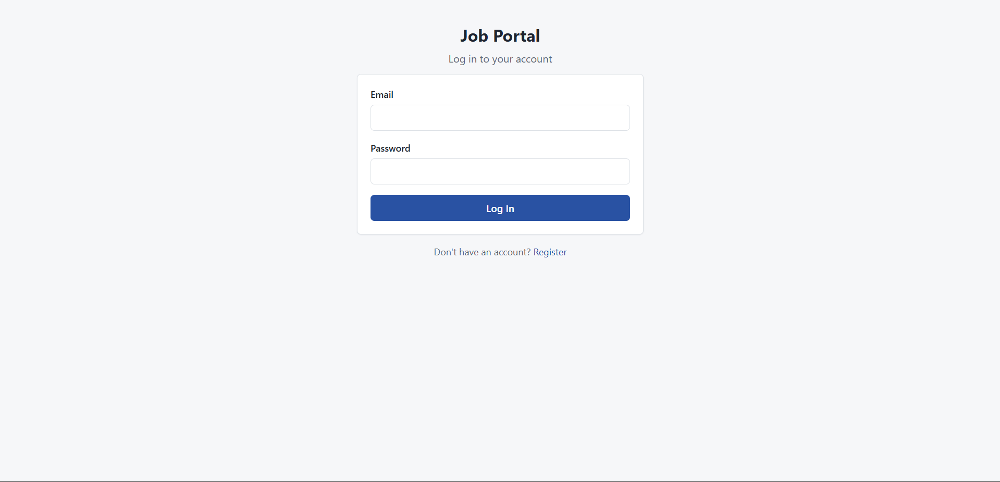 | 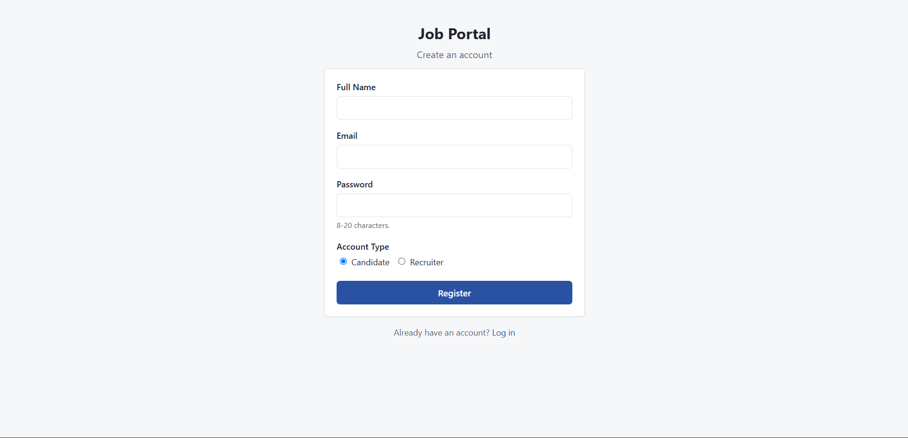 | 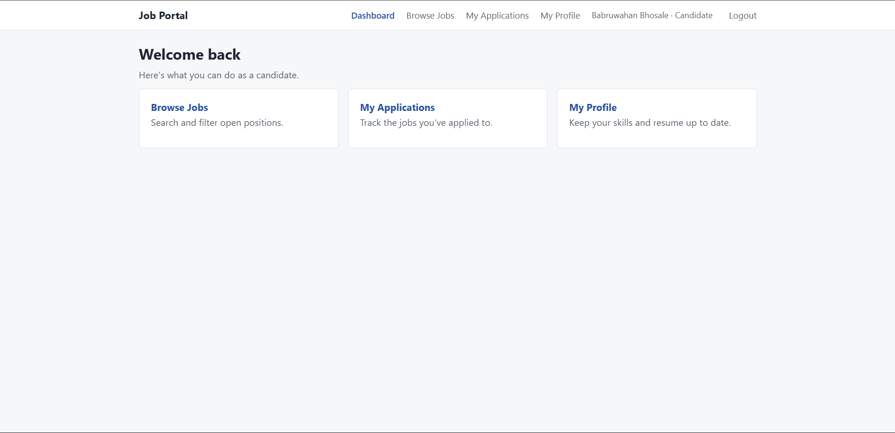 |


| ### 👤 Candidate Profile | ### 💼 Job Listings | ### 📄 Job Details |
|---|---|---|
| 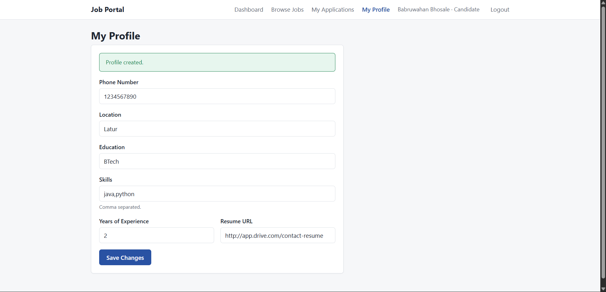 | 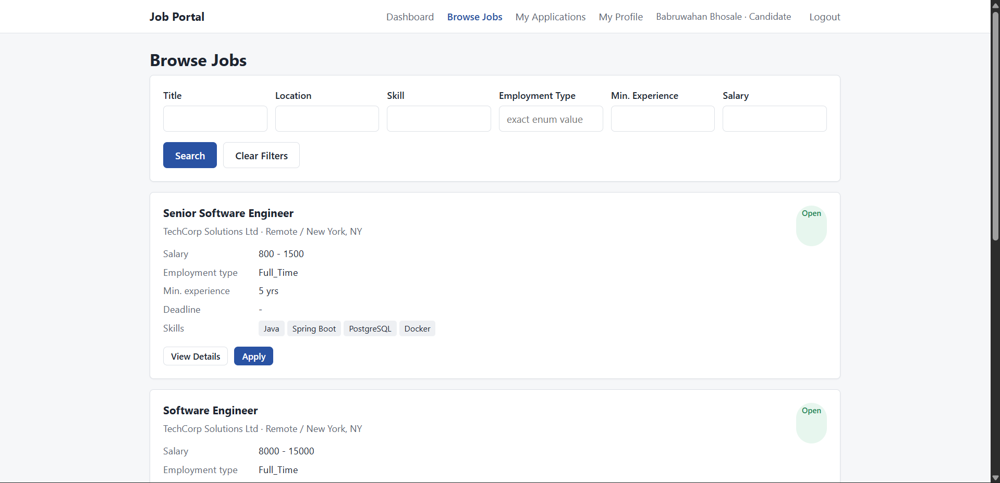 | 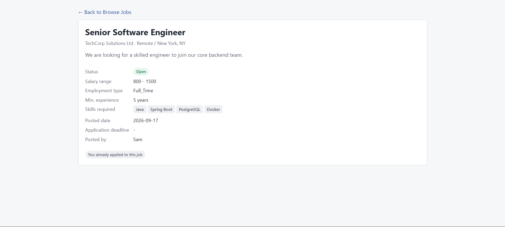 |


| ### 📋 Candidate Applications | ### 🏢 Recruiter Dashboard | ### 👥 Job Applications |
|---|---|---|
| 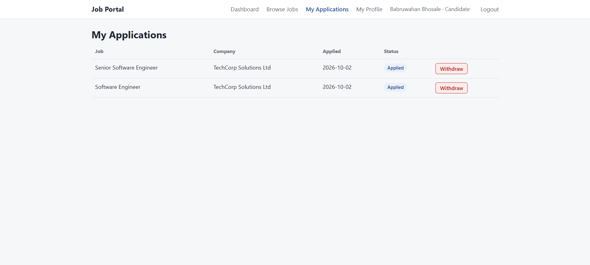 | 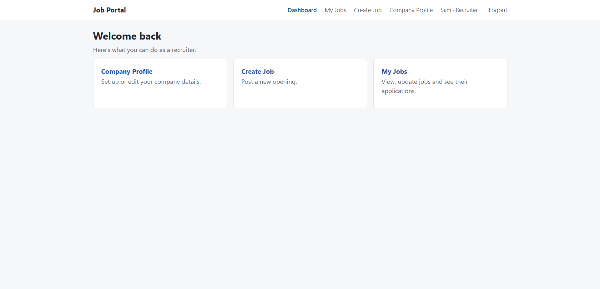 | 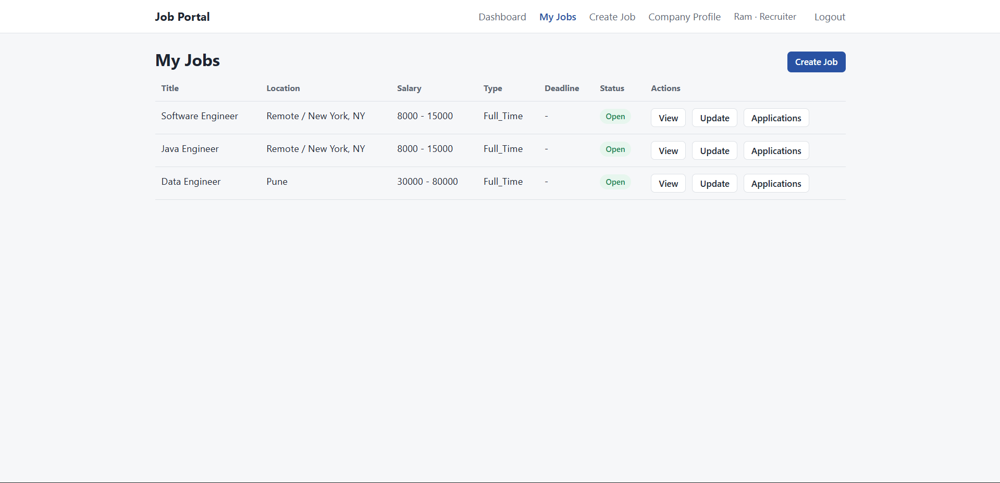 |


| ### ➕ Create Job | ### 📋 Candidate Job Application |
|---|---|
| 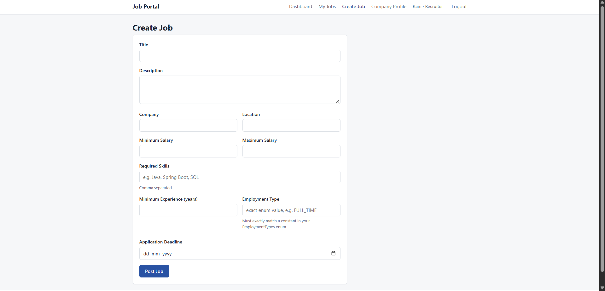 | 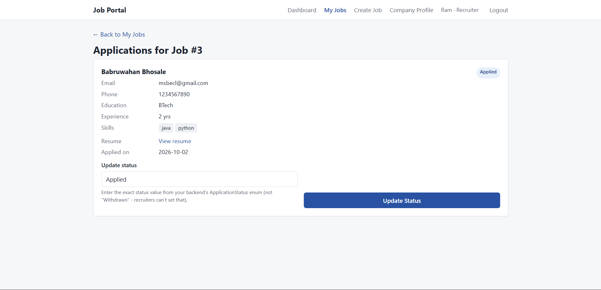 |


...

## 🛠️ Tech Stack

### Backend

| Technology      | Purpose               |
| --------------- | --------------------- |
| Java            | Backend programming   |
| Spring Boot     | Application framework |
| Spring MVC      | REST API development  |
| Spring Data JPA | Data access           |
| Hibernate       | ORM                   |
| MySQL           | Database              |
| Maven           | Dependency management |

### Frontend

| Technology | Purpose                            |
| ---------- | ---------------------------------- |
| HTML5      | Page structure                     |
| CSS3       | Styling                            |
| JavaScript | Frontend logic & API communication |
| Fetch API  | REST API communication             |

### Tools

* IntelliJ IDEA
* MySQL
* Postman
* Git
* GitHub

---

## 🏗️ Architecture

The backend follows a layered architecture:

```text
Client
  │
  ▼
Frontend
HTML / CSS / JavaScript
  │
  │ REST API
  ▼
Controller Layer
  │
  ▼
Service Layer
  │
  ▼
Repository Layer
  │
  ▼
Hibernate / JPA
  │
  ▼
MySQL Database
```

The backend follows the general:

```text
Controller
     ↓
Service
     ↓
Repository
     ↓
Database
```

architecture.

DTOs are used for API request/response handling instead of directly exposing entities wherever applicable.

---

## 🗃️ Main Entities

The application contains the following major entities:

```text
User
 │
 ├── CandidateProfile
 │       │
 │       └── JobApplication
 │
 └── RecruiterProfile
         │
         └── Job
              │
              └── JobApplication
```

### Main entities

* `UserEntity`
* `CandidateProfileEntity`
* `RecruiterProfileEntity`
* `JobEntity`
* `JobApplicationEntity`

---

## 🔐 Authentication

The current application uses **HTTP Session-based authentication**.

After successful login, the backend creates a session and stores the logged-in user's ID in the session.

The frontend sends authenticated requests with session credentials.

JWT authentication is not used in the current version.

---

## 📡 Main API Groups

### Authentication

```text
POST   /job-portal/auth/register
POST   /job-portal/auth/login
POST   /job-portal/auth/logout
```

### Candidate Profile

```text
POST   /job-portal/candidate/profile/create
GET    /job-portal/candidate/profile/view
PUT    /job-portal/candidate/profile/update
```

### Recruiter Profile

```text
POST   /job-portal/recruiter/profile/create
GET    /job-portal/recruiter/profile/view
PUT    /job-portal/recruiter/profile/update
```

### Jobs

```text
POST   /job-portal/job/create
PUT    /job-portal/job/update
GET    /job-portal/job/view
GET    /job-portal/job/view/all
GET    /job-portal/job/search&filter
```

### Applications

```text
POST   /job-portal/job/application/create
GET    /job-portal/job/application/candidate/view
GET    /job-portal/job/application/recruiter/view
PATCH  /job-portal/job/application/recruiter/update
PATCH  /job-portal/job/application/candidate/withdraw
```

> API parameters and request/response structures are defined by the backend controllers and DTOs.

---

## 🖥️ Frontend

The frontend provides separate interfaces for Candidates and Recruiters.

### Candidate UI

```text
Login
  ↓
Candidate Dashboard
  ├── Profile
  ├── Browse Jobs
  ├── Job Details
  ├── Apply
  └── My Applications
```

### Recruiter UI

```text
Login
  ↓
Recruiter Dashboard
  ├── Company Profile
  ├── Create Job
  ├── My Jobs
  └── Applications
```

The frontend communicates with the Spring Boot backend using REST APIs and JavaScript `fetch()`.

---

## ⚙️ Backend Setup

### 1. Clone the repository

```bash
git clone https://github.com/SAM-rv/Job-Portal.git
```

```bash
cd Job-Portal
```

### 2. Create MySQL Database

Create a MySQL database for the application.

```sql
CREATE DATABASE job_portal;
```

Update the database configuration in:

```text
src/main/resources/application.properties
```

Example:

```properties
spring.datasource.url=jdbc:mysql://localhost:3306/job_portal
spring.datasource.username=YOUR_USERNAME
spring.datasource.password=YOUR_PASSWORD

spring.jpa.hibernate.ddl-auto=update
spring.jpa.show-sql=true
```

Use your own MySQL username and password.

---

### 3. Run the Spring Boot application

Using Maven:

```bash
mvn spring-boot:run
```

Or run the main Spring Boot application class from IntelliJ IDEA.

The backend will normally be available at:

```text
http://localhost:8080
```

---

## 🌐 Frontend Setup

The frontend is built using HTML, CSS and JavaScript.

You can run it using a local development server such as **VS Code Live Server**.

For example:

```text
http://127.0.0.1:5500
```

The frontend communicates with the Spring Boot backend running on:

```text
http://localhost:8080
```

If the frontend and backend are running on different origins, appropriate CORS configuration is required.

---

## 🧪 Testing

The REST APIs can be tested using **Postman**.

Recommended testing flow:

### Candidate

```text
Register
   ↓
Login
   ↓
Create Profile
   ↓
Browse Jobs
   ↓
Search Jobs
   ↓
View Job
   ↓
Apply
   ↓
View Applications
   ↓
Withdraw Application
```

### Recruiter

```text
Register
   ↓
Login
   ↓
Create Company Profile
   ↓
Create Job
   ↓
View Jobs
   ↓
Update Job
   ↓
View Applications
   ↓
Update Application Status
```

---

## 📌 Business Rules

Some important business rules implemented in the application include:

* Email must be unique.
* A user has a specific role.
* Candidates can manage candidate profiles.
* Recruiters can manage recruiter profiles.
* Recruiters can create and manage their own jobs.
* Candidates can apply for jobs.
* A candidate cannot submit duplicate applications for the same job.
* Recruiters cannot apply for jobs.
* Candidates cannot manage recruiter resources.
* Recruiters can manage applications for their own jobs.
* Closed/expired jobs cannot accept applications.
* Application status is controlled by the application workflow.

---

## 📁 Project Structure

### Backend

```text
src
└── main
    └── java
        └── com.example
            └── jobportal
                ├── controller
                ├── service
                ├── repository
                ├── entity
                ├── dto
                ├── exception
                ├── specification
                └── ...
```

> Package names may differ depending on the current project structure.

### Frontend

```text
frontend
├── index.html
├── login.html
├── register.html
│
├── candidate
│   ├── dashboard.html
│   ├── profile.html
│   ├── jobs.html
│   ├── job-details.html
│   └── applications.html
│
├── recruiter
│   ├── dashboard.html
│   ├── profile.html
│   ├── create-job.html
│   ├── jobs.html
│   └── applications.html
│
├── css
│   └── ...
│
└── js
    └── ...
```

---

## 🔮 Future Improvements

Possible future improvements include:

* Spring Security
* JWT authentication
* Password hashing with BCrypt
* Pagination and advanced sorting
* Email notifications
* Resume file upload
* Profile image upload
* Admin dashboard
* Saved/bookmarked jobs
* Job recommendations
* Advanced skill matching
* Automated testing
* API documentation using Swagger/OpenAPI
* Deployment to a cloud platform

---

## 🎯 Learning Objectives

This project was developed to gain practical experience with:

* Spring Boot REST API development
* Layered backend architecture
* Spring Data JPA
* Hibernate entity relationships
* MySQL database integration
* DTO-based API design
* REST API development
* Session-based authentication
* Role-based business logic
* Exception handling
* Dynamic search/filtering using Spring Data JPA Specifications
* Frontend-backend integration
* Git and GitHub

---

## 👨‍💻 Author

**Rutavik Dhumal**

B.Tech – Information Technology

Interested in:

* Java Backend Development
* Spring Boot
* REST APIs
* SQL / MySQL
* Full-Stack Java Development
